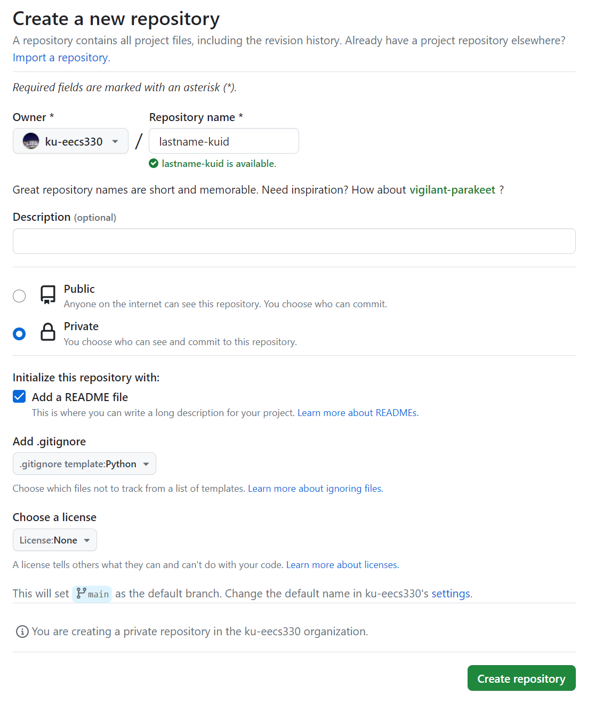

# EECS 330 Lab-1
## Goal: _Python setup and execution, Github setup and upload_

### Due date:  
* Saturday 09/07/2024 (for everyone)


### Objective

Python setup, compilation, debugging and execution.

### Specification of the Assignment

We encourage you to complete as much of this setup as you can on your own.


### A. Python Installation through Conda on Linux (No admin is needed!)

Miniconda : Command line Installation on Linux machine ([link](https://docs.conda.io/en/latest/miniconda.html))
```sh
> mkdir -p ~/miniconda3

> wget https://repo.anaconda.com/miniconda/Miniconda3-latest-Linux-x86_64.sh -O ~/miniconda3/miniconda.sh

> bash ~/miniconda3/miniconda.sh -b -u -p ~/miniconda3

> rm -rf ~/miniconda3/miniconda.sh
```
After installing, initialize your newly-installed Miniconda. The following commands initialize for bash and zsh shells:

```sh
> ~/miniconda3/bin/conda init bash

> ~/miniconda3/bin/conda init zsh
```

Add environment variable path

```sh
> export PATH="/home/username/miniconda3/bin:$PATH"

> conda --version
```
Should display installed conda version. With this command, you have successfully installed conda on your linux machine

Common Helper:

```sh
> conda env list <-- list all environments

> conda create -n newenv python=3.10 <-- create new environment

> conda enc create -f env.yml <-- create environment from config file

> conda activate envname <-- activate a environment

> conda deactivate <-- exit environment
```


### B.	Learn to Use Linux Terminal (Also works for Mac Terminal)

If you already know how to open and use a terminal, skip this section.
* The terminal is an application that allows you to run all sorts of programs, as well as manipulate files in your own computer. 
* It is a powerful but also dangerous tool, so please be careful with using some of these commands. On Unix-like operating systems, the Terminal application will provide you with everything that you need. 
* On macOS, for example, you can use Spotlight to search for the Terminal application.
* The lab computers run the Linux operating system. As such, you can use terminal commands to make changes to your directory and files. Here are some important ones that you may find useful in this course.


`cd`: change your working directory.

```sh
cd hw
```

`pwd`: present working directory
```sh
pwd
```
This command will tell you the full absolute path for the current directory you are in if you are not sure where you are.

`.`: means your current directory
```sh
cd .
```
This command will change your directory to the current directory (aka. do nothing).

`..`: means one parent directory above your current directory
```sh
cd ..
```
This command will change your directory to its parent. If you are in /workspace/day1/, the command will place you in /workspace/.

`ls`: list files/folders in directory
```sh
ls
```
This command will list all the files and folders in your current directory.
```sh
ls -l
```
This command will list all the files and folders in your current directory with timestamps and file permissions. This can help you double-check if your file updated correctly or change the read-write- execute permissions for your files.

`mkdir`: make a directory
```sh
mkdir dirname
```
This command will make a directory within the current directory called `dirname`.

`rm`: remove a file
```sh
rm file1
```
This command will remove file1 from the current directory. It will not work if file1 does not exist.
```sh
rm -r dir1
```
This command will remove the `dir1` directory recursively. In other words, it will delete all the files and directories in `dir1` in addition to `dir1` itself. Be careful with this command!
`cp`: copy a file
```sh
cp lab1/original lab2/duplicate
```
This command will copy the `original` file in the `lab1` directory and create a `duplicate` copy in the `lab2` directory.

`mv`: move or rename a file
```sh
mv lab1/original lab2/original
```
This command moves `original` from `lab1` to `lab2`. Unlike `cp`, mv does not leave original in the `lab1` directory.
```sh
mv lab1/original lab1/newname
```
This command does not move the file but rather renames it from original to newname.

There are some other useful tricks when navigating on a command line:
* Your shell can complete file names and directory names for you with tab completion. When you have an incomplete name (for something that already exists), try pressing the tab key for autocomplete or a list of possible names.
* If you want to retype the same instruction used recently, press the up key on your keyboard until you see the correct instruction. This saves typing time if you are doing repetitive instructions (like running Python programs on the command line while testing).

### C. Github Setup
* First open up your terminal. Check that git is a recognized command by typing the following command:

```sh
git --version
```
* Share your git username with your TA. You will be invited to an git organization of EECS 330. In which you will create a repository with your name as lastname-kuid (__lower case__) (for example: mallojula-12345678). Your repo must be private (only you and TAs will be able to see it). Once your repo is created as 
</br> </br>
add your TA as collaborator to your repo (`Settings`->`Colaborators and teams`->`Add people`). Your TA's guthub username can be found at [frontpage](https://github.com/ku-eecs330/lab-schedule).

* Prepare for local-remote git communication through SSH. You need to generate a new SSH key on linux machine and add it to your git account: [Tutorial](https://docs.github.com/en/authentication/connecting-to-github-with-ssh/generating-a-new-ssh-key-and-adding-it-to-the-ssh-agent?platform=linux). Finish the 1st and 2nd step shoud be good for most cases.

* In terminal, enter the folder you would like to place your git repo (for example: `cd ~/Github/eecs330`). Clone your empty git to local
```sh
> git clone [remote-repo-URL] 
```
You will have a new folder at local, which is connected with your remote repo at github.

* Enter your repo: `cd ~/Github/eecs330/lastname_kuid`


### D. Let’s ensure that everything is working.
* First, let’s check that python is working. Start by running the following commands at your terminal:
```sh
> conda activate eecs330
> python --version
```
You should see the current version number like `Python 3.10.XX`.

Then create a folder for your code
```sh
> cd Github/eecs330/LastName-KUID <--replace with your last name and kuid. This should be the folder of your repo.
> mkdir Lab-2
> cd Lab-2
```

* In this newly opened directory, create a file `HelloWorld.py` with linux editor like `nano` (or you can just open GUI editor and save it to target folder). Type the following lines in your `.py` file.

```python
print("Hello World”)
```

* In your terminal, enter `ls` (list the files/folders in this directory). You should see `HelloWorld.py` listed.

* Run the python code:
```sh
> ls <-- you should see the file you will execute, like "HelloWorld.py"
> python HelloWorld.py <-- you should see the message printed
```
If this command produces any error,  something may be wrong with your setup. Try opening a new terminal window or restarting your computer. If that still doesn’t work, contact TA.

* You’re done! The code is good. You commit your change and push the code to github.

### E. Submitting Through GitHub
Use git commands to commit and track changes as below
* `git status`: Show the modifications you have made since your last update

* `git add`: Choose the files you would like to commit (you can just commit all changes by `git add ./`)

* `git commit`: Commits the files you added to current git repo branch (default branch: `main`)

* `git log`: Lists all the commits

* `git show`: Lists a specific method commit and changes made in file

* `git checkout`: Rolls back changes specific to a commit. After tis we can directly commit. No need to again git -add

* `git remote -v`: Lists all locations for network data transfers.

* `git pull [remote-repo-name] main`: Get the most recent copy of the files as seen in remote-repo-name (you can use `git pull` to simply work on `main` branch if no one is collaborate with you). 

* `git push [remote-repo-name] main`: Pushes the most recent copy of your files to the remote-repo-name (you can use `git push` to simply work on `main` branch if no one is collaborate with you).

To upload your code, in your terminal:
```sh
> git pull <-- always make your local git repo updated.
> git status <-- always check your local changes first
> git add ./ <-- stage all modification in your folder ("HelloWorld.py" file in this case)
> git commit -m "upload my first python code" <-- commit your changes with a message. You can type anything.
> git push <-- you update the github at the server with your local change
```

### F. Refreshing python language (Optional)
* Once the jupyter notebook can be run in your machine, please play with the following code to refresh our python knowledge (useful for better understanding our following lectures):  [link](https://github.com/ku-eecs330/lab-schedule/blob/main/Lab-1/Lab-1_fall24.ipynb) 

### Testing and Grading  

You will be submitting your code via GitHub repository created for EECS330. For this Lab, once you are done with set up and push `HelloWorld.py` onto Github repo and completes your Lab work.


### Submission and Deadline 
Please submit through GitHub and grades will be posted based on completed work with out any issues.
