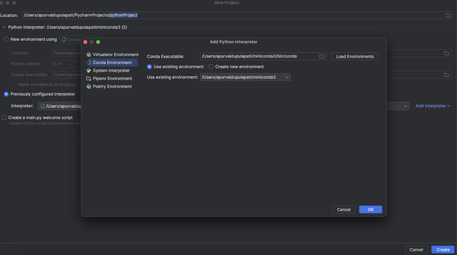
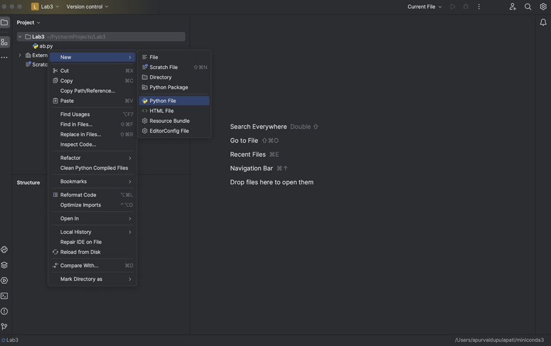
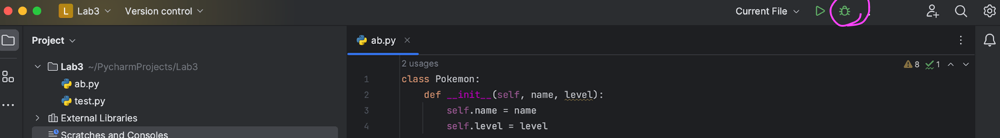
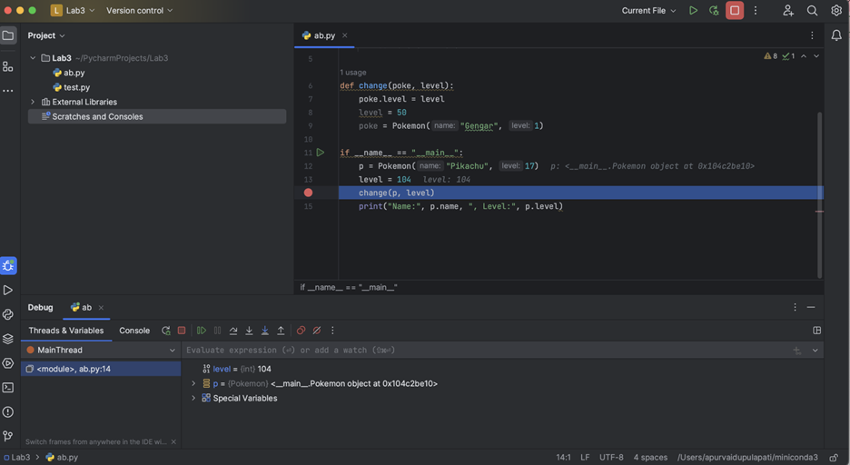

# EECS 330 Lab-2


## Goal: _IDE installation, coding, and Debugging_

### Due date (based on your lab time):
- Monday 09/02/2024 (No lab due to Labor Day, please join any other lab that fits your schedule)
  - Using the due day of the alternative lab you join.
- Tuesday 09/03/2024
  - Due on Friday 09/06/2024 11:59 pm
- Wednesday 09/04/2024
  - Due on Saturday 09/07/2024 11:59 pm
- Friday 09/06/2024
  - Due on Monday 09/09/2024 11:59 pm

### A. Integrated Development Environment (IDE) - PyCharm

**1.  PyCharm Installation**

All the Lab systems are installed with PyCharm or download the PyCharm Community Edition, for personal computers:

- Windows: <https://www.jetbrains.com/pycharm/download/?section=windows>

- MacOS: <https://www.jetbrains.com/pycharm/download/?section=mac>

- Linux: <https://www.jetbrains.com/pycharm/download/?section=linux>

**2.  Using PyCharm**

PyCharm is an integrated development environment (IDE) used for writing and managing Python code. It offers features like code assistance, debugging, code navigation, version control support, and customization options. PyCharm comes in both free (Community Edition) and paid (Professional Edition) versions, making it accessible to developers on various platforms.

Quick setup: https://www.jetbrains.com/pycharm/guide/tutorials/getting-started-pycharm/


**2.1. Creating a Python File and Choosing the Virtual Environment:**

- Open the PyCharm application.

- Click on "Create Project."

- Specify the desired location to save the project.

- Provide a name for the project.

- Select the previously configured interpreter by clicking the "Add Interpreter" button.

- In the dialog that appears, choose the Conda environment you want to use.

- Click "OK" to confirm the interpreter selection.

- After selecting the interpreter, click on "Create" to create the new project with the chosen interpreter and settings.



- right-click on the project folder in the Project tool window and choose "New" > "Python File."




**2.2. Coding**
In the code editor, you can start writing your Python code. You can add functions, classes, variables, and any other code constructs as needed.

**3. Debugging**

&nbsp;&nbsp;&nbsp;&nbsp;&nbsp;&nbsp;&nbsp;&nbsp;**a. Set Breakpoints:**

 &nbsp;&nbsp;&nbsp;&nbsp;&nbsp;&nbsp;&nbsp;&nbsp;&nbsp;&nbsp;&nbsp;- Navigate to the Python script or module you want to debug.

 &nbsp;&nbsp;&nbsp;&nbsp;&nbsp;&nbsp;&nbsp;&nbsp;&nbsp;&nbsp;&nbsp;- Click in the left margin of the code editor at the line where you want to set a breakpoint. A red dot will appear, indicating a breakpoint.

&nbsp;&nbsp;&nbsp;&nbsp;&nbsp;&nbsp;&nbsp;&nbsp;**b. Start Debugging:**

 &nbsp;&nbsp;&nbsp;&nbsp;&nbsp;&nbsp;&nbsp;&nbsp;&nbsp;&nbsp;&nbsp;&nbsp;- Click on the debug option that is on the top right corner.



&nbsp;&nbsp;&nbsp;&nbsp;&nbsp;&nbsp;&nbsp;&nbsp;**c. Debugging Panel:**

&nbsp;&nbsp;&nbsp;&nbsp;&nbsp;&nbsp;&nbsp;&nbsp;&nbsp;&nbsp;&nbsp;&nbsp;- Once the debugger is running, the Debugging panel will appear at the bottom of the PyCharm window. This panel provides information about your program's state.

 &nbsp;&nbsp;&nbsp;&nbsp;&nbsp;&nbsp;&nbsp;&nbsp;&nbsp;&nbsp;&nbsp;&nbsp;- You can see variables, stack traces, and control buttons (e.g., step into, step over, resume, stop).

&nbsp;&nbsp;&nbsp;&nbsp;&nbsp;&nbsp;&nbsp;&nbsp;**d. Inspect Variables:**

 &nbsp;&nbsp;&nbsp;&nbsp;&nbsp;&nbsp;&nbsp;&nbsp;&nbsp;&nbsp;&nbsp;&nbsp;- While debugging, you can inspect the values of variables by hovering over them in the code editor or checking the Variables panel in the Debugging panel.



&nbsp;&nbsp;&nbsp;&nbsp;&nbsp;&nbsp;&nbsp;&nbsp;**e. Fix Issues:**

 &nbsp;&nbsp;&nbsp;&nbsp;&nbsp;&nbsp;&nbsp;&nbsp;&nbsp;&nbsp;&nbsp;&nbsp;- When you identify a problem in your code, you can modify it directly in the code editor while debugging. PyCharm will apply the changes without having to stop and restart the debugger.

&nbsp;&nbsp;&nbsp;&nbsp;&nbsp;&nbsp;&nbsp;&nbsp;**f. Exit Debug Mode:**

 &nbsp;&nbsp;&nbsp;&nbsp;&nbsp;&nbsp;&nbsp;&nbsp;&nbsp;&nbsp;&nbsp;&nbsp;- Once you've completed debugging, you can exit debug mode by clicking the "Stop" button in the Debugging panel or by closing the debugging panel.

&nbsp;&nbsp;&nbsp;&nbsp;&nbsp;&nbsp;&nbsp;&nbsp;**g. Executing the code:**

 &nbsp;&nbsp;&nbsp;&nbsp;&nbsp;&nbsp;&nbsp;&nbsp;&nbsp;&nbsp;&nbsp;&nbsp;- To run your Python code, you can click on the run button on top of code editor.

 &nbsp;&nbsp;&nbsp;&nbsp;&nbsp;&nbsp;&nbsp;&nbsp;&nbsp;&nbsp;&nbsp;&nbsp;- When you run your Python script, the output will appear in the "Run" or "Debug" tool window at the bottom of the PyCharm window.
 


### B. Debuging Sample Code in PyCharm
Let's run an example of using PyCharm debugging tool. Please use the code example and go through the steps in the tutorial at 

<https://www.jetbrains.com/help/pycharm/part-1-debugging-python-code.html>


```python
import math

class Solver:

    def demo(self, a, b, c):
        d = b ** 2 - 4 * a * c
        if d > 0:
            disc = math.sqrt(d)
            root1 = (-b + disc) / (2 * a)
            root2 = (-b - disc) / (2 * a)
            return root1, root2
        elif d == 0:
            return -b / (2 * a)
        else:
            return "This equation has no roots"


if __name__ == '__main__':
    solver = Solver()

    while True:
        a = int(input("a: "))
        b = int(input("b: "))
        c = int(input("c: "))
        result = solver.demo(a, b, c)
        print(result)
```

Basically, the class and method in the sample aim to solve the quadratic equation in mathematics. Three variable `a`, `b`, and `c` will be required from user input. Then the code will calculate the following quadratic formula to solve `x`:

<p align="center">

</p>

Using the debugging tool in PyCharm, you are able to inspect the step-wise results to locate the issues in your code. Please run the debugging with the following two sets of input:

1. `a = 1; b = 4; c = 1`
2. `a = 2; b = 4; c = 2`
3. `a = 3; b = 4; c = 2`

For submission, please take a screenshot for the inline debugging of each input, showing the step-wise variable values.

**Testing and Grading:** You should submit your screenshots via a GitHub repository created for EECS 330. For this lab, create a folder named "Lab-2" and push your image files into that folder on the GitHub repository to complete your lab work. 


**Submission and Deadline:** Please submit through GitHub and grades will be posted based on completed work without any issues.
