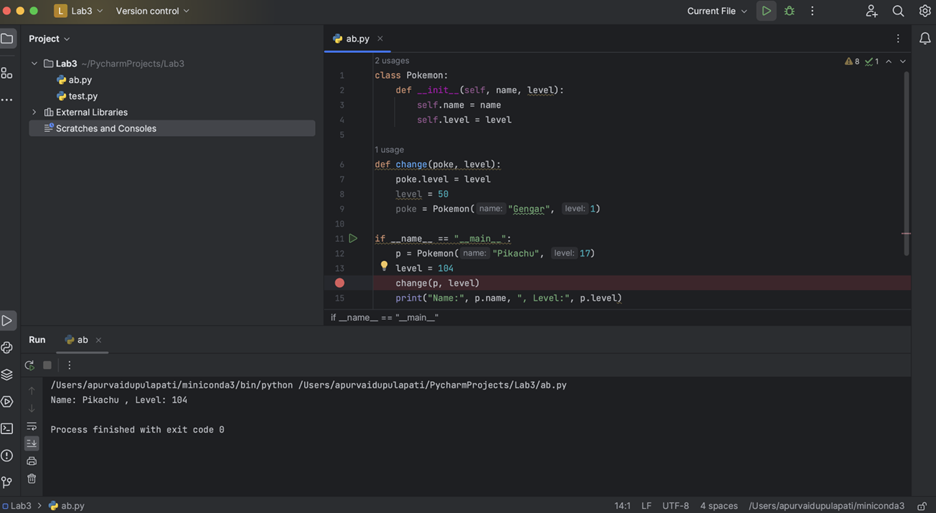

# EECS 330 Lab-2


## Goal: _IDE, Debugging, Linked Lists_

### Due date (based on your lab time):
- Monday 09/02/2024 (No lab due to Labor Day, please join any other lab that fits your schedule)
  - Using the due day of the alternative lab you join.
- Tuesday 09/03/2024
  - Due on Friday 09/06/2024 11:59 pm
- Wednesday 09/04/2024
  - Due on Saturday 09/07/2024 11:59 pm
- Friday 09/06/2024
  - Due on Monday 09/19/2024 11:59 pm

### A. Integrated Development Environment (IDE) - PyCharm

**1.  PyCharm Installation**

All the Lab systems are installed with PyCharm or download the PyCharm Community Edition, for personal computers:

- Windows: <https://www.jetbrains.com/pycharm/download/?section=windows>

- MacOS: <https://www.jetbrains.com/pycharm/download/?section=mac>

- Linux: <https://www.jetbrains.com/pycharm/download/?section=linux>

**2.  Using PyCharm**

PyCharm is an integrated development environment (IDE) used for writing and managing Python code. It offers features like code assistance, debugging, code navigation, version control support, and customization options. PyCharm comes in both free (Community Edition) and paid (Professional Edition) versions, making it accessible to developers on various platforms.

Quick setup: https://www.jetbrains.com/pycharm/guide/tutorials/getting-started-pycharm/


**2.1. Creating/opening a Python File:**

- Open the PyCharm application.

- Click on "Create Project."

- Specify the desired location to save the project.

- Provide a name for the project.

- Select the previously configured interpreter by clicking the "Add Interpreter" button.

- In the dialog that appears, choose the Conda environment you want to use.

- Click "OK" to confirm the interpreter selection.

- After selecting the interpreter, click on "Create" to create the new project with the chosen interpreter and settings.


- right-click on the project folder in the Project tool window and choose "New" > "Python File."


**2.2. Coding**

In the code editor, you can start writing your Python code. You can add functions, classes, variables, and any other code constructs as needed.

**3. Debugging**

&nbsp;&nbsp;&nbsp;&nbsp;&nbsp;&nbsp;&nbsp;&nbsp;**a. Set Breakpoints:**

 &nbsp;&nbsp;&nbsp;&nbsp;&nbsp;&nbsp;&nbsp;&nbsp;&nbsp;&nbsp;&nbsp;- Navigate to the Python script or module you want to debug.

 &nbsp;&nbsp;&nbsp;&nbsp;&nbsp;&nbsp;&nbsp;&nbsp;&nbsp;&nbsp;&nbsp;- Click in the left margin of the code editor at the line where you want to set a breakpoint. A red dot will appear, indicating a breakpoint.

&nbsp;&nbsp;&nbsp;&nbsp;&nbsp;&nbsp;&nbsp;&nbsp;**b. Start Debugging:**

 &nbsp;&nbsp;&nbsp;&nbsp;&nbsp;&nbsp;&nbsp;&nbsp;&nbsp;&nbsp;&nbsp;&nbsp;- Click on the debug option that is on the top right corner.


&nbsp;&nbsp;&nbsp;&nbsp;&nbsp;&nbsp;&nbsp;&nbsp;**c. Debugging Panel:**

&nbsp;&nbsp;&nbsp;&nbsp;&nbsp;&nbsp;&nbsp;&nbsp;&nbsp;&nbsp;&nbsp;&nbsp;- Once the debugger is running, the Debugging panel will appear at the bottom of the PyCharm window. This panel provides information about your program's state.

 &nbsp;&nbsp;&nbsp;&nbsp;&nbsp;&nbsp;&nbsp;&nbsp;&nbsp;&nbsp;&nbsp;&nbsp;- You can see variables, stack traces, and control buttons (e.g., step into, step over, resume, stop).

&nbsp;&nbsp;&nbsp;&nbsp;&nbsp;&nbsp;&nbsp;&nbsp;**d. Inspect Variables:**

 &nbsp;&nbsp;&nbsp;&nbsp;&nbsp;&nbsp;&nbsp;&nbsp;&nbsp;&nbsp;&nbsp;&nbsp;- While debugging, you can inspect the values of variables by hovering over them in the code editor or checking the Variables panel in the Debugging panel.


&nbsp;&nbsp;&nbsp;&nbsp;&nbsp;&nbsp;&nbsp;&nbsp;**e. Fix Issues:**

 &nbsp;&nbsp;&nbsp;&nbsp;&nbsp;&nbsp;&nbsp;&nbsp;&nbsp;&nbsp;&nbsp;&nbsp;- When you identify a problem in your code, you can modify it directly in the code editor while debugging. PyCharm will apply the changes without having to stop and restart the debugger.

&nbsp;&nbsp;&nbsp;&nbsp;&nbsp;&nbsp;&nbsp;&nbsp;**f. Exit Debug Mode:**

 &nbsp;&nbsp;&nbsp;&nbsp;&nbsp;&nbsp;&nbsp;&nbsp;&nbsp;&nbsp;&nbsp;&nbsp;- Once you've completed debugging, you can exit debug mode by clicking the "Stop" button in the Debugging panel or by closing the debugging panel.

&nbsp;&nbsp;&nbsp;&nbsp;&nbsp;&nbsp;&nbsp;&nbsp;**g. Executing the code:**

 &nbsp;&nbsp;&nbsp;&nbsp;&nbsp;&nbsp;&nbsp;&nbsp;&nbsp;&nbsp;&nbsp;&nbsp;- To run your Python code, you can click on the run button on top of code editor.

 &nbsp;&nbsp;&nbsp;&nbsp;&nbsp;&nbsp;&nbsp;&nbsp;&nbsp;&nbsp;&nbsp;&nbsp;- When you run your Python script, the output will appear in the "Run" or "Debug" tool window at the bottom of the PyCharm window.
 



### B. Implementation of linked list methods

Given the following sample coes:
```python
class SLList:
    class IntNode:
        def __init__(self, item, next_node):
            self.item = item # int
            self.next = next_node # IntNode
            
    def __init__(self):
        self.first = None # initialize an empty list

    def addFirst(self, item):
        self.first = self.IntNode(item, self.first)
```


**1.1 Insert an Item (25 pts)**

Implement method `SLList.insert()` which takes in an integer `item` and an integer `position`. It inserts `item` at the given `position`. If `position` is after the end of the list, insert the new node at the end. For example, if the SLList is 5 → 6 → 2, insert (10, 1) results in 5 → 10 → 6 → 2, and if the SLList is 5 → 6 → 2, insert (10, 7) results in 5 → 6 → 2 → 10. Additionally, for this problem assume that position is a non-negative integer.

```python
def insert (self, item, position):
```


**1.2 Reverse the List (25 pts)**

Add another method to the class `SLList.reverse()` that reverses the elements. Do this using the existing `IntNode` objects (you should not use new).

```python
def reverse(self):
```

**1.3 Replicate the List (25 pts)**

Write a non-destructive method `SLList.replicate()` that replaces the `item` at `position` with `item` copies of itself. For example, replicate (3 → 2 → 1]) would return 3 → 3 → 3 → 2 → 2 → 1. For this question assume that all elements of the array are positive.  ("non-destructive" means that you will create a new linked list without changing the old one).

```python
def replicate(self):
```
**1.4 Write the Testing Case (25 pts)**

Create and run tests on your 1.1, 1.2, 1.3 to ensure its correctness. For example:
```python
if __name__ == '__main__':
  L = SLList()
  L.addFirst(15)
  L.addFirst(10)
  L.addFirst(5)
  L.reverse()

  L_expect = SLList()
  L_expect.addFirst(5)
  L_expect.addFirst(10)
  L_expect.addFirst(15)	

  if L.equals(L_expect):
    print("Two lists are equal, tests passed")
  else:
    print("Two lists are not equal, tests failed")
```

You can see that you will need an `SLList.equals` method to evaluate if two lists are the same. Please write the function to compare two `SLList` objects in terms of their values.
```python
def equals(self, anotherList):
```

**1.4 (Extra) Another Implementation (10 pts)** 

If you wrote reverse iteratively, write a second version that uses recursion (you may need a helper method). If you wrote it recursively, write it iteratively.


**Testing and Grading:** You should submit your code via a GitHub repository created for EECS 330. For this lab, create a folder named "Lab-3" and push all your `.py` files into that folder on the GitHub repository to complete your lab work. 

**Submission and Deadline:** Please submit through GitHub and grades will be posted based on completed work without any issues.